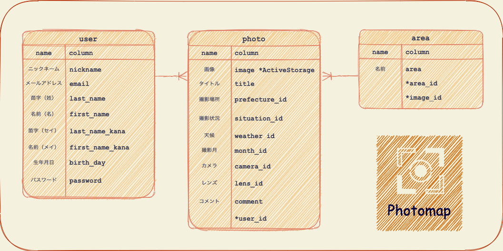

# Photomap
- ユーザー管理機能
    - アカウントの登録・更新
    - アイコン画像の設定(マイページ・ヘッダーに表示)
    - 自己紹介文の作成

- 写真投稿機能
    - 複数枚の写真の投稿
    - 写真投稿をする際のプレビュー機能
    - トップページ・マイページへの表示

- 動画投稿機能
- 写真検索機能

<!-- #### アプリURL
##### https://photomap-32068.herokuapp.com/

#### テスト用アカウント
email：abc123@gmail.com
password：abc123 -->

# DEMO

## 利用方法

- ユーザー管理機能
    - アカウントの登録
        1. ページ上部の['Signin']を選択
        1. 各項目を入力
        1. ["アカウント登録"]を選択
        1. アカウントが登録されました

    - アカウントの更新・自己紹介文の作成
        1. マイページの["編集する"]を選択
        1. 各項目を入力（※アイコン画像は最初の1枚のみ登録可能です）
        1. ["更新する"]を選択
        1. アカウントが更新されました

- 写真投稿機能
    1. ログインしたアカウントでheaderの["Post"]を選択
    1. 各項目を入力
    1. ["投稿する"]
    1. トップページに表示されます
       尚、自身が投稿した写真はマイページに表示されます

## 目指した課題解決
##### 旅行や、写真撮影が好きな方に向けて
- 紙の媒体が減りデジタル化が進む中、今まで旅行先で撮影した写真を見返す機会が減少したとを感じていました。 
そんな中、自身が撮影した写真を誰かと共有できるアプリがあれば便利だと思いました。 
また、地図上で表示させることにより、どの場所でどのような写真が撮れるのかを、視覚的に表現したアプリを作成していきます。

## 洗い出した要件
- ユーザー管理機能
    - アカウントの登録・更新
    - アイコン画像の設定(マイページ・ヘッダーに表示)
    - 自己紹介文の作成
    - 投稿した写真の件数を表示
    - フォローしている人数を表示 ※未実装
    - フォローされている人数を表示 ※未実装

- 写真投稿機能
    - 複数枚の写真の投稿
        - 撮影時の詳細な情報を加えて投稿（タイトル/コメント/撮影場所/撮影状況/天候/撮影月/カメラ機種/レンズ種類 ）
        - 複数枚投稿した写真に関しては、スライド機能を実装
    - 写真投稿をする際のプレビュー機能の実装
    - 写真詳細ページの作成 ※未実装
        - 写真編集・削除ページの作成

- 動画投稿機能 ※未実装
    - 動画の投稿

- 写真検索機能（MAP上で） ※未実装
    - 日本地図の各都道府県をクリックすると、各地で撮影された写真が表示される
    - 投稿のない地域については、MAP上で表示を変える

- 写真検索機能 ※未実装
    - 検索欄でキーワードを入力すると写真の一覧が表示される

## 実装した機能

- 複数枚の画像の投稿
  

- マイページの編集
  

## ER図

